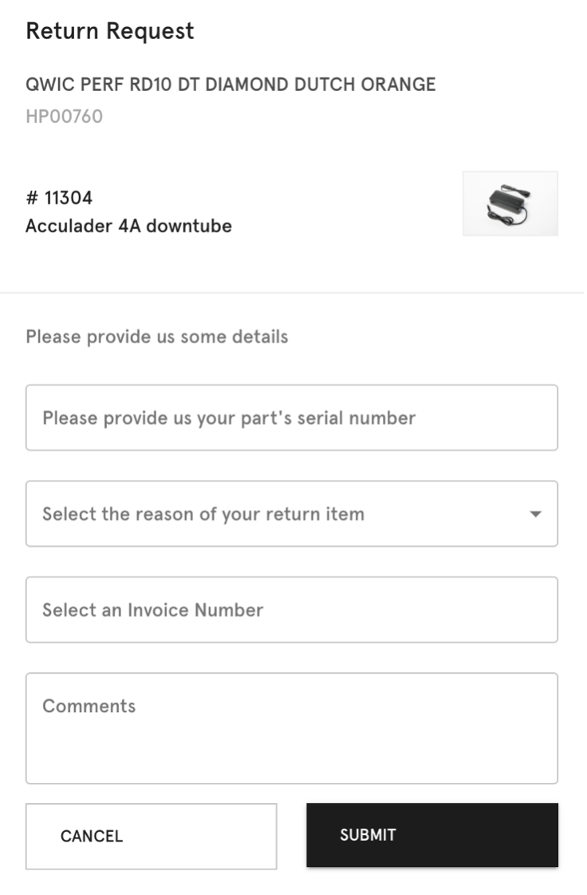

# QWIC React / JS take home assignment

As a bike company, we would like to improve the process of returning broken parts. This challenge is really based on your ability to create a form and an endpoint that can submit the said form.

-   You may use any react scaffold tools to jump start your project.
-   You may use any utility libraries such as lodash.js.
-   You may use any existing react UI libraries such as Google’s Material UI.
-   You may use the UI asset above for inspiration to build your own form.

Form validation rules

-   User should be able to input part serial number
-   Any random alpha numeric value is accepted
    -   Value should be at least six characters and at most ten characters
-   User should be able to input an invoice number
    -   Any random numeric value is accepted
    -   Value should be at most six characters
-   User should be able to select from a pre-defined set of return reasons

    -   Broken part
    -   Unused part
    -   Other

-   If user selects “other”, user should be able to add comments via an extra text field
-   Text field should have a max character limit of 240
-   User should have the option to add any further details before submitting the form via free text field
    -   Free text field value is optional and is not required in order to submit the form successfully
    -   Free text field should have a max character limit of 240

Backend:

-   One endpoint required just to submit the form.
-   One endpoint to retrieve all return cases.
-   We will use a REST client to verify this endpoint.
-   You are allowed to use any node.js backend frameworks
-   You are allowed to mock the database layer.
-   You are allowed to use any test framework

In Readme (Not code):

-   If this were to go to production, what presistent layer would you use and why?
-   Describe your data schema for creating returns.
-   What do you need to consider if this application needs to be highly available?

Evaluation
• Implementation of the above exercise
• Documentation
• Ease of setup in a local machine
• Error handling and proper end to end form validation.
• Some end to end test coverage

Time
• Around five hours

Solution
• Github repo
